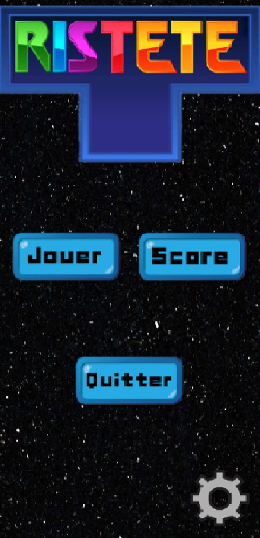

# Ristete - Tetris for Android

## Description

Ristete is a Tetris game designed for Android devices. This project was developed in Java during my 2nd year of DUT in computer science using Android Studio.

## Features

- Classic Tetris gameplay
- Designed for mobile Android devices
- Developed using Android Studio

## Installation

1. Clone the repository: `git clone https://github.com/ndium/Ristete.git`
2. Open the project in Android Studio.
3. Build and run the app on your Android device or emulator.

## Usage

- Use on-screen controls to move and rotate Tetriminos or the phone's gyroscope..
- Clear lines to score points.
- Game over if the Tetriminos reach the top.

## Acknowledgments

- Special thanks to [Android Studio](https://developer.android.com/studio) for the development environment.

## Screenshots

